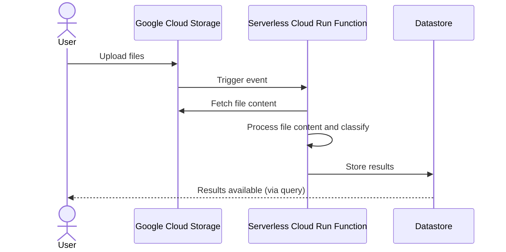

# Solution Overview

## Current Implementation

### Approach

1. **Flask Web Application**
    - Provides an endpoint for users to upload files.
    - Manages the flow of file processing and classification.

2. **File Processors**
    - Utilises a **Factory Pattern** to dynamically select the appropriate file processor based on file type.
    - Current file processors include:
        - **PDFProcessor**: Extracts text from PDF files.
        - **ImageProcessor**: Uses OCR to extract text from image files.

3. **Content Classifiers**
    - Leverages a **Strategy Pattern** to apply different classification techniques based on the file’s content.
    - Classifiers include:
        - **TextClassificationClassifier**: Uses a pre-trained model for text-based classification.
        - **ZeroShotClassificationClassifier**: Allows flexible classification against dynamic label sets.

4. **Repository for Results**
    - Processed results are currently returned directly to the user.
    - No persistent storage for classified results is implemented in this version.

---

## Challenges with the Current Implementation

1. **Scalability**
    - The system processes files synchronously, limiting its ability to handle a large number of concurrent requests.

2. **Durability**
    - There is no persistent storage for uploaded files or classification results, making recovery from failures
      difficult.

3. **Resource Management**
    - The Flask application requires manual scaling to handle increased workload.

4. **Model tuning**
    - Given more time, the models could be fine-tuned to improve classification accuracy.

---

## A Scalable Solution

To address the challenges, the following architecture is proposed, leveraging Google Cloud services for scalability and
durability.

### Proposed Architecture

With any system, the bottlenecks usually lie in IO, the database and horizontal scaling of processes. The following is a
proposed solution.

The proposed solution’s flow is illustrated below:

1. **File Upload and Storage**
    - Files are uploaded to **Google Cloud Storage (GCS)** for reliable and scalable storage.
    - This makes sense for large volumes of files and decouples ingestion from classification.
    - Google Cloud Storage offers an SDK which is able to upload files directly, allowing for parallel composite
      uploads, resuming and batch operations

2. **Event-Driven Processing**
    - A **Cloud Run function** is triggered upon file upload to process the file asynchronously.
    - This would allow us to scale processing based on demand and handle large volumes of files asynchronously.
    - Because Cloud Run is serverless, it can scale to zero when there are no requests, reducing costs.

3. **Classification and Results Storage**
    - The Cloud Run function processes the file, classifies its content, and stores the results in **Google Cloud
      Datastore**.
    - Datastore is a high performance NoSQL database that can handle large volumes of writes.
